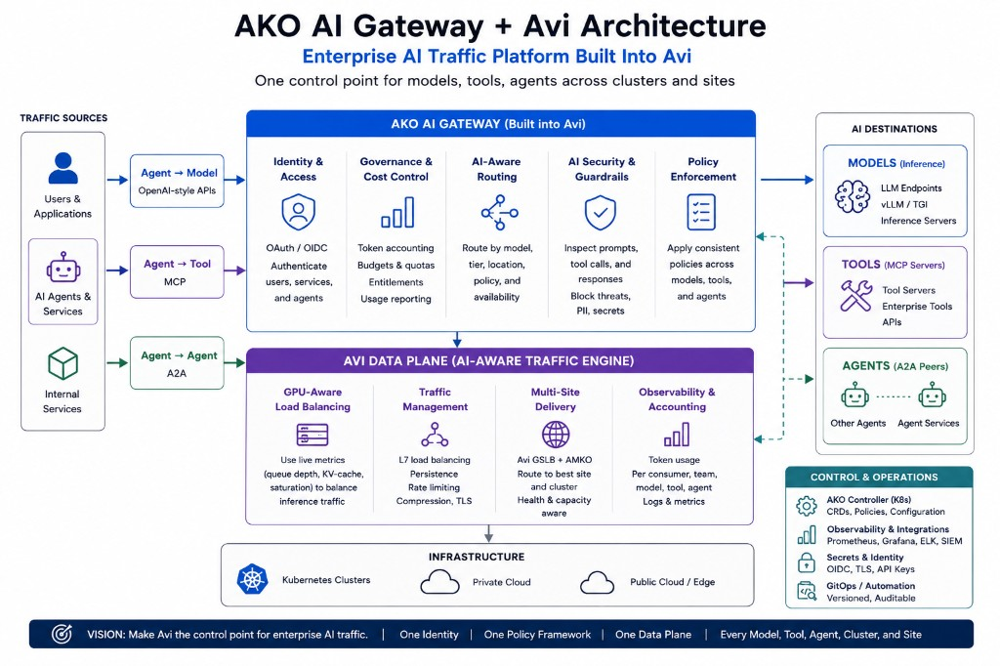

# AKO AI Gateway — Overview

The AKO AI Gateway turns the Avi Load Balancer into the entry point for AI traffic on
Kubernetes. It authenticates callers, meters and governs usage, routes requests to the right
model, and inspects content for data loss and abuse — using the Avi Service Engines an
organization already runs, **with no new data-plane proxy in the request path**. Every
capability is expressed as a Kubernetes CRD that attaches to a Gateway API route and is
reconciled by AKO into native Avi features.

The goal it is built toward is to govern the **whole agent loop under one verified identity** —
inference calls to LLMs, tool calls to MCP servers, and agent↔agent delegation — all under the
same authentication, the same policies, and the same usage accounting. All three surfaces are
now built. The capability table below states exactly where each piece stands; the sections that
follow do not get ahead of it.

> **New to this system?** Start with the **[Handbook](ai-gateway-handbook.md)** — architecture,
> a console guide with screenshots, how-to guides, and the security posture in one document.
> **[Release notes](ai-gateway-release-notes.md)** carry the full feature history.

**New to Avi?** Two terms run through this doc. The **Avi Controller** is the control plane
(configuration, API, analytics). The **Service Engine (SE)** is the data plane — the proxy that
actually carries traffic. **AKO** (Avi Kubernetes Operator) watches Kubernetes CRDs and programs
the Controller, which in turn drives the SEs. The core idea here is that all of the AI
governance below runs on SEs you already operate — no new proxy or sidecar enters the request
path.

---

## What you actually run

The "no new data plane" claim is specifically about the **request hot path**: no proxy or
sidecar is inserted between caller and backend — the SEs you already operate do the work. A few
roadmap capabilities do add components you operate *outside* that path, and they are called out
in their sections: the semantic-guardrail classifier (the SE calls it over ICAP, as it already
calls the OIDC issuer), a SPIRE server plus a small SVID-rotation controller for backend mTLS,
and AMKO for multi-site delivery. None sit in the request path, but they are real things to run.

---

# Available

The following capabilities are built and callable in the gateway today.

| Capability | What it provides |
|---|---|
| [Console (UI)](#console--the-ai-gateway-ui) | Avi-style web console to view and drive the entire gateway |
| [Inference](#inference) | Metric-weighted load balancing across model-server pods |
| [Authentication](#authentication) | JWT/OIDC validation for browser **and** machine clients, with verified identity/claims |
| [Token Counting](#token-counting) | Per-consumer / per-group token budgets, counters, rate limits |
| [Token Ledger](#token-ledger) | True per-user and per-agent *consumption* accounting, beside the enforcement counter |
| [Model Routing](#model-routing) | Model-aware routing to quality/cost tiers, with entitlements — including tiers served by an external provider or **another cluster** |
| [Guardrails & DLP](#guardrails--dlp) | WAF-native data-loss prevention and content guardrails |
| [MCP](#mcp-agenttool) | The same governance for agent↔tool (Model Context Protocol) traffic |
| [Semantic Guardrails](#semantic-guardrails) | Model-based prompt-injection detection over ICAP, escalating past what WAF signatures catch |
| [A2A](#a2a-agentagent) | Governance for agent↔agent (Agent2Agent) delegation traffic |
| [Agent Factory](#agent-factory) | Describe an agent in plain language; the platform provisions it, governed, behind the A2A gateway |

The agent loop has three governance surfaces; the gateway covers all three:

| Surface | Protocol | Governed by | Status |
|---|---|---|---|
| agent ↔ model | OpenAI-style HTTP | [Authentication](#authentication) + [Model Routing](#model-routing) | **Available** |
| agent ↔ tool | MCP (JSON-RPC + Streamable HTTP) | [MCP Gateway](#mcp-agenttool) | **Available** |
| agent ↔ agent | A2A (JSON-RPC over HTTPS) | [A2A Gateway](#a2a-agentagent) | **Available** |

---

## Console — the AI Gateway UI

The gateway ships with an **Avi-Controller-style web console** that makes the whole gateway
visible and operable without hand-editing YAML. It is a single static Go binary with an embedded
Clarity-style SPA, styled to match Avi's look, talking to the cluster through its own
ServiceAccount + RBAC and to the Avi Controller's read-only REST API for live data-plane state.
It lives in a companion repo (`gricec1981/ai-gateway-ui`), separate from AKO. **Available.**

It gives operators a live **topology** (SE → gateways → backends with health edges), **live
token counters** per consumer/group against budgets, editing of the auth/token-rate and model-
routing policies, `InferencePool` management, gateway creation, an **approved MCP-server
registry** with reachability probes, and a per-gateway **DLP toggle** (enforce vs shadow) backed
by the mode-delegation flip described under Guardrails. It is deployed in-cluster and verified
against real OIDC traffic; in the demo environment it is reached via `kubectl port-forward`.

## Inference

Inference is the foundation everything else routes *over*, and it is the most mature capability
in the gateway. The Inference Extension load-balances traffic **within** a model fleet: an
`InferencePool` groups the pods serving a model, and the gateway distributes requests across
them using live metrics scraped from each pod — KV-cache utilization, request-queue depth, and
running-slot occupancy — so load follows real serving capacity rather than simple round-robin.

This matters because model servers are GPU-bound and their cost-per-request is dominated by
tail latency. In internal benchmarking under load, replacing round-robin with the
metric-weighted algorithm cut **p90 time-to-first-token from roughly 125 s to roughly 10 s** —
an order-of-magnitude improvement on the metric users feel most. Every model tier and every
route below ultimately lands on an inference pool whose members are weighted by current load.

→ [Native Inference Extension](inference-extension.md) · [Install guide](inference-install.md)

## Authentication

Authentication is the trust anchor the rest of the gateway builds on. The gateway authenticates
API consumers with **JWT / OAuth-OIDC** at the Service Engine, against one identity provider
serving the whole gateway. The verified identity and claims — the consumer's `sub` and their
`group`/`role` — are made available to every downstream policy, so token budgets are keyed on
them, tier entitlements are decided from them, and MCP/A2A authorization reads the same claims.

One `AIGatewayAuthPolicy` handles **both** kinds of caller, selected by `authMode`:

- **`oauthBrowser`** (default) — interactive/browser clients run the OAuth auth-code flow and
  carry a session cookie; an unauthenticated request is redirected to the IdP.
- **`jwtQuery`** — machine clients (SDKs, agents, MCP, `curl`) present a bearer JWT as a `?jwt=`
  query parameter; an unauthenticated request gets a `401`, not a redirect. This is what lets
  non-browser **agents** authenticate while their claims stay readable to policy.

The two modes exist because of a real Avi constraint: the SE's browser-OAuth path exposes claims
to policy but ignores a bearer header, while its resource-server JWT path validates a bearer but
hides the claims. `jwtQuery` threads the needle by validating the token from the query string,
which survives to the policy layer. Both modes require the listener to terminate TLS.

→ [AI Gateway Authentication — `AIGatewayAuthPolicy`](ai-gateway-auth.md)

## Token Counting

The gateway meters **token usage**, not just request count. It reads token counts from model
responses and maintains running counters per consumer and per group in Service Engine shared
state, enforcing **token budgets** over a time window alongside classic request-rate limits. Per limit, enforcement is either the DataScript counter (per-SE, default) or — with `backend: native`, which the LLM front door runs — the Avi rate limiter, exact across Service Engines.
Budgets vary by group, so different tiers of users get different ceilings. Usage is also exposed
through a read-only counters endpoint that the [console](#console--the-ai-gateway-ui) polls.
Token counting is configured with an `AITokenRateLimitPolicy` and keys its accounting on the
identity established by authentication.

→ [Token Rate Limiting — `AITokenRateLimitPolicy`](ai-gateway.md#token-rate-limiting--aitokenratelimitpolicy)

## Token Ledger

The budget counter and an accounting figure want opposite things: enforcement wants a number it
can reset, accounting wants a record it can never lose. The ledger adds the second beside the
first. The SE writes one immutable usage record per metered response — identity, model, tier,
prompt/completion/cached/reasoning tokens, route — into a ring it also serves at a drain
endpoint; the console polls that ring into a durable store and renders Dashboard ▸ Tokens by
user and by agent. The enforcement counter is unchanged and still enforces budgets.

Measured on the live estate: the SE's recording is exact to the token at 333 rps and
concurrency 128; the *collector* is the lossy half, with a ceiling near 200 rps sustained.
Streaming responses still cannot be metered at all — that is the standing RFE.

→ [AI Gateway token ledger](ai-gateway-token-ledger.md)

## Model Routing

Model routing reads the requested **model** from each incoming request and steers it to a
backend organized by **quality/cost tier** — for example a premium tier on high-end GPUs, a
standard tier on smaller accelerators, and an economy tier on quantized or CPU hardware. This
turns the model name into a cost-and-quality control: expensive hardware serves only the
requests entitled to it, and everything else lands on cheaper backends. Tiers can be gated by
the caller's verified group, and a caller who asks for a tier they aren't entitled to is
downgraded to one they are. Configured with an `AIModelRoutePolicy`; composes with
authentication and token budgets on the same route.

A tier does not have to be pods in this cluster. Four backend kinds are supported and all are
built: an `InferencePool` (per-pod metric weighting), a core `Service` (endpoints — so a
selectorless Service plus a hand-written EndpointSlice fronts a GPU VM or bare metal as a
first-class tier), an **external provider** (an OpenAI-compatible vendor API over SE egress,
with the key injected from a Secret), and a **remote site** — a peer AI Gateway in another
cluster, verified cross-cluster on the lab estate. A labelled model pod can also publish its own
alias into the model→tier table, so deploying a model and publishing it become one action.

→ [Model-Based (Quality/Cost Tier) Routing](model-routing.md)

## Guardrails & DLP

Guardrails add the **content-inspection** layer: stop secrets, PII, and known attacks from
entering prompts, tool arguments, and agent messages — and, optionally, leaking back out. This
runs on the data plane already in place: the SE's native **WAF** (ModSecurity-based) does the
regex matching and request/response-body inspection. No proxy, no sidecar, no model in the path.

An `AIGuardrailPolicy` ships pre-canned **profiles** per surface — `BlockLLM` (DLP +
prompt-injection signatures), `BlockMCP` (DLP + tool-abuse: command-injection / path-traversal /
SSRF), and `BlockLLMAndMCP` — so an operator drops one CR per route or gateway, and AKO authors
the Avi WafPolicy from it and attaches it to the route's virtual service. AKO maintains a
built-in **signature library** (secret detectors for AWS/GCP/OpenAI/GitHub/Slack keys, private
keys, JWTs; PII detectors for SSN, credit-card, email; prompt-injection patterns; MCP tool-abuse
patterns), plus per-policy keyword denylists and custom regex. The prompt-injection detectors
are evasion-resistant: each runs a normalized pass (lowercase, URL/unicode-decode, whitespace
removal) and a base64-decode pass, so spaced-out text, zero-width tricks, and `%`-encoding are
caught. A mode-delegation trick keeps `Block` vs `Log` (shadow) a per-rule flip — which is what
the console's DLP toggle drives.

The AKO side is built, and request-body DLP blocking is **verified by spike**: an AWS key, SSN,
or API secret in a prompt returned `403` while a clean prompt passed. Being signature/regex
based, this layer catches known patterns but cannot do semantic detection — see below.

→ [Guardrails & DLP — `AIGuardrailPolicy`](ai-gateway-guardrails.md)

## MCP (agent↔tool)

MCP support extends the same governance to **agent↔tool** traffic. Agents call tools over the
Model Context Protocol, and the gateway fronts those tool servers through a dedicated **MCP
Gateway** that keeps stateful agent sessions pinned to the right backend (using Avi 32.1.1's
native MCP session awareness) and brings tool traffic under the same identity and policy model
as the LLM gateway.

**Tool authentication and authorization.** An agent calling a tool authenticates exactly as it
calls a model: a bearer JWT (the `jwtQuery` machine-client mode) validated at the Service Engine
against the **same identity provider** as the LLM gateway — so one agent carries one verified
identity across both its inference and its tool calls, and the same `sub` / `group` / `role`
claims are in scope for both. The verified **role** then drives **per-tool authorization**: the
`AIMCPRoutePolicy` maps roles to the tools they may invoke, so a single MCP server can expose
different tool subsets to different job roles, and a call to a tool the caller's role isn't
entitled to is rejected before it reaches the backend. Two gates stack here — the **approved MCP
registry** is the *server-level* allow-list (which tool servers may be fronted at all), and
role-based tool auth is the *call-level* gate (which tools a given caller may actually invoke on
them).

Configured with an `AIMCPRoutePolicy`. The controller and translator are wired and working, and
the MCP Gateway is callable today.

→ [MCP Gateway & MCP-Specific Routes](ai-gateway-mcp.md)

## A2A (agent↔agent)

A2A governs the third surface: agents calling **other agents** — delegation and task hand-off
over the Agent2Agent protocol (JSON-RPC over HTTPS). A dedicated **A2A Gateway** authenticates
against the same identity provider, authorizes **per-skill** (each Agent Card advertises
`skills[]`), pins long-running stateful tasks via session affinity, and governs
push-notification egress so agents can only call approved webhooks. Unlike MCP — which Avi
32.1.1 supports natively — A2A has no native Avi support and is built from generic primitives
plus DataScripts, making it architecturally closer to model routing. Configured with an
`AIA2ARoutePolicy`.

**Built and running.** Each minted token is bound to one target agent by its `resource` claim,
the agent-card skill is enforced at the Service Engine as well as at mint time, and two
fail-closed switches (`requireMethod`, `authorizePaths`) mean no request reaches a backend
without having been matched against something. Agents are catalogued in the
[agent registry](ai-gateway-agent-registry.md) and provisioned by the
[agent factory](ai-gateway-agent-factory.md).

→ [A2A Gateway & Agent-to-Agent Routes](ai-gateway-a2a.md)

---

## Semantic Guardrails

The model-based half of `AIGuardrailPolicy`: a **prompt-injection classifier** the SE calls over
**ICAP** to catch the novel/paraphrased injection the signature layer provably misses. It
preserves the no-proxy model — the SE buffers the request body and *calls* the classifier as a
service (as it already calls the OIDC issuer), then the SE enforces the block; the model is
never a proxy in the request path. **Built and verified end-to-end** on live Avi 31.2.1
(openshift06): an embedding-prototype classifier, a pure-stdlib ICAP shim, and AKO authoring of
the `icapprofile` + security-policy rule from `AIGuardrailPolicy.semantic`. FP-hardened to v2 and
re-verified live (openshift06, 2026-08-14) — the classifier's benign-anchor set now covers
imperative-but-benign prompts (counting, output-format constraints, agent/tool traffic) that had
been false-positiving, plus a gray-zone LLM-judge cascade for uncertain scores.
→ [Semantic Guardrails (prompt-injection over ICAP)](ai-gateway-guardrails-semantic.md)

## Agent Factory

An operator describes an agent in plain language and the platform creates everything else: a
running agent, holding its own ServiceAccount identity, protected by the shared-IdP auth policy,
routed through the A2A gateway on its own hostname, and catalogued in the agent registry behind a
register → approve → route gate. Chat alone never applies anything — the extractor *proposes* a
spec and an operator approves it.

The design decision that makes it practical is that creating an agent **builds no image**: one
config-driven runtime serves every agent, so the factory is a provisioner rather than a CI
system. A second body (Google's ADK, for multi-agent fan-out) drops in behind the same ConfigMap,
route, policy and registry entry — only the image changes.

→ [Agent Factory](ai-gateway-agent-factory.md) · [Framework agent runtimes](ai-gateway-agent-framework.md) · [Agent registry](ai-gateway-agent-registry.md)

## RAG over the estate's own source

An MCP tool (`code_search`) that answers questions about this system with citations into its own
GitHub source. It is also the honest demonstration of *indirect* prompt injection: retrieved
content is scored by the same classifier that guards the front door, so a poisoned document is
quarantined rather than fed to the model.

→ [AI Gateway RAG](ai-gateway-rag.md)

---
---

# Planned

The following are specified but not yet built. They are included here so the full
"govern the whole agent loop" thesis is legible — not as shipping features.

| Capability | What it provides |
|---|---|
| [Backend mTLS](#backend-mtls-spiffespire) | SE↔backend mutual TLS with SPIFFE/SPIRE short-lived identity · *spike-gated* |
| [Multi-Site Delivery](#multi-site-cross-cluster-delivery) | Geo/capacity site steering via AMKO + Avi GSLB · *spike-gated*. The **single-peer** case is built — see Model Routing |
| [One gateway per surface](#one-gateway-per-surface-many-clusters) | Three gateways for a whole estate rather than one per cluster |
| [Cross-cluster agent authorization](ai-gateway-cross-cluster-auth.md) | One A2A policy governing agents in every cluster. Blocked first on an ambiguous subject: the issuer's `sub` is a bare ServiceAccount name and collides across clusters |
| [AgentMinder as identity broker](ai-gateway-agentminder-pdp.md) | Replace the hand-rolled in-cluster issuer with a supported broker, keeping enforcement in the SE |
| A2A push-notification egress allow-list | Governs the webhook an agent may POST task updates to. Designed and spike-proven, never carried into the CRD — [ai-gateway-a2a.md §8](ai-gateway-a2a.md) |
| A tier that names a *set* of sites | Today a `remote` tier names one peer, so peer-down is tier-down — [ai-gateway-datacenter.md §6](ai-gateway-datacenter.md) |
| Streaming token metering | Streamed responses cannot be metered on the data plane at all; the demo runs non-streaming. This is the standing RFE — [rfe-se-ai-native-callout.md](rfe-se-ai-native-callout.md) |
---

## Backend mTLS (SPIFFE/SPIRE)

Authentication secures the north-bound hop (caller → gateway); backend mTLS secures the
south-bound hop (gateway → backend). The SE presents a client certificate to inference pools and
MCP servers and validates theirs, with both sides using **SPIFFE SVIDs** issued by **SPIRE** —
short-lived, auto-rotated workload identity rather than long-lived shared certs. It extends the
implemented `RouteBackendExtension.BackendTLS` (one-way TLS today) with an `seClientCert` field,
plus a small controller that pulls the SE's SVID from SPIRE and rotates it at half-life. **In
design**; the make-or-break open question — whether the Avi pool can pin a SPIFFE **URI SAN**
rather than just a DNS name — is *spike-gated*.

→ [Backend mTLS with SPIFFE/SPIRE](ai-gateway-backend-mtls.md)

## Multi-Site (cross-cluster) delivery

**The simple case is already built.** A tier can name a peer AI Gateway in another cluster
(`tiers[].remote`), and that is verified cross-cluster on the lab estate. It uses no GSLB: the SE
resolves the peer's name itself and a health monitor decides whether the peer is up, so which
site serves a request is decided by *tier selection* after the model is read from the body — not
by DNS answering a client. It covers one peer per tier, in one datacentre, with no geo steering.

What remains in design is the layer above that: **many** sites per tier, geo and capacity
steering, and a dedicated cross-site transit path, composing the per-cluster AI Gateway,
model-based tier routing and **AMKO + Avi GSLB**. GPUs are scarce and scattered; this layer
delivers a request to the best site that can serve the model it wants, without a new data plane.
**In design**; cross-site behaviour is *spike-gated*. The nearer step — a tier that names a set
of peers, still without GSLB — is specified in the datacenter doc §6.

→ [Multi-Site (Cross-Cluster) Model Delivery](ai-gateway-multisite.md) · [One Gateway for a Datacenter](ai-gateway-datacenter.md)

## One gateway per surface, many clusters

Rather than one AI gateway per cluster, an estate can run **three** — LLM, MCP and agent — each
owned by a single entry cluster and fronting workloads that stay where they are. The LLM surface
flattens cleanly; MCP sessions and A2A tasks pin to a backend server, and that pin is exact only
for single-server pools, which decides the topology. **In design**, on shipped parts.

→ [One Gateway per Surface, Many Clusters](ai-gateway-single-gateway.md) · [One Gateway for a Datacenter](ai-gateway-datacenter.md)

---

## Getting started

- [AI Gateway install guide](ai-gateway-install.md) — enable the feature and apply the auth and
  token-counting policies.
- [Inference install guide](inference-install.md) — set up `InferencePool`-based inference load
  balancing.

## Related docs

- [Handbook](ai-gateway-handbook.md) — the whole system in one document: architecture, console
  guide with screenshots, how-tos, security posture
- [Native Inference Extension](inference-extension.md) — metric-weighted load balancing
- [AI Gateway Authentication](ai-gateway-auth.md) — `AIGatewayAuthPolicy`, `oauthBrowser` + `jwtQuery`
- [AI Gateway](ai-gateway.md) — authentication and token counting reference
- [Model-Based Routing](model-routing.md) — quality/cost tier routing
- [MCP Gateway](ai-gateway-mcp.md) — agent↔tool traffic governance
- [Guardrails & DLP](ai-gateway-guardrails.md) · [Semantic Guardrails](ai-gateway-guardrails-semantic.md) — content inspection
- [A2A Gateway](ai-gateway-a2a.md) — agent↔agent traffic governance
- [A2A Agent Registry](ai-gateway-agent-registry.md) — ConfigMap catalog, console registry view, `/.well-known/agents` federation
- [Backend mTLS](ai-gateway-backend-mtls.md) — SE↔backend mutual TLS with SPIFFE/SPIRE
- [Multi-Site Delivery](ai-gateway-multisite.md) — cross-cluster model routing
- [Cross-Cluster Agent Authorization](ai-gateway-cross-cluster-auth.md) — one `AIA2ARoutePolicy` governing every cluster (design only, not yet implemented)
- [One Gateway per Surface, Many Clusters](ai-gateway-single-gateway.md) — a single LLM/MCP/agent gateway for a whole estate: design, benefits, limitations
- [One Gateway for a Datacenter](ai-gateway-datacenter.md) — the LLM front door sized at fifteen clusters
- [Provider Failover Design](ai-provider-failover-design.md) — cross-provider failover strategies (design only, not yet implemented)
- [Release Notes](ai-gateway-release-notes.md) — what shipped, by date
