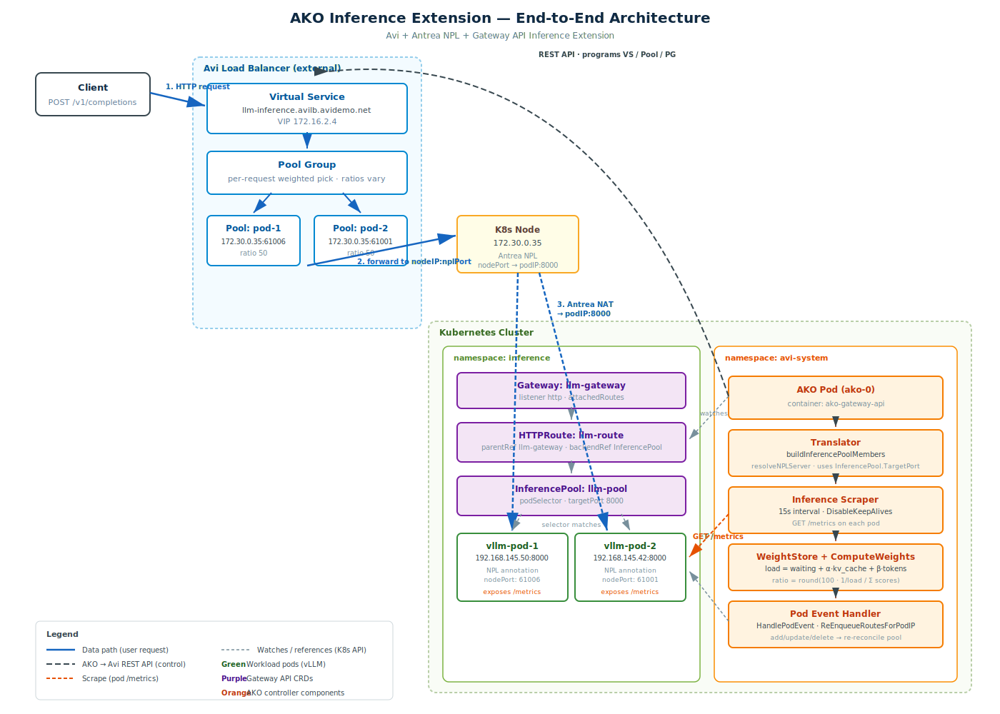

# AKO Native Inference Extension

## Overview

AKO supports load balancing for LLM inference workloads via a native implementation of the [Gateway API Inference Extension](https://gateway-api-inference-extension.sigs.k8s.io/) (`gateway.inference.x-k8s.io`).

Instead of using Envoy's External Processing (ext-proc) and a separate Endpoint Picker (EPP) sidecar, AKO implements intelligent backend selection directly in the controller. AKO periodically scrapes Prometheus metrics from each LLM pod — request queue depth, KV-cache occupancy, and slot utilisation — and translates them into Avi Pool Group member weights, steering traffic away from overloaded instances automatically.

This approach works with any gateway that AKO manages — no ext-proc support is required.

---

## How It Works



The diagram above shows the full end-to-end flow:

- **Data path (blue):** Client request hits the Avi Virtual Service (VIP), is routed to a pool selected by the Pool Group using the computed ratio, then forwarded to the Kubernetes node via the Antrea NPL-mapped `nodeIP:nplPort`. Antrea NATs it to the pod overlay IP.
- **Control path (dashed dark):** AKO programs the Virtual Service, Pool Group, and per-pod Pools via the Avi REST API after each reconcile cycle.
- **Scrape path (orange):** The Inference Scraper goroutine polls each pod's `/metrics` endpoint every `scrapeIntervalSeconds`, feeds results into the WeightStore, and re-enqueues the HTTPRoute so the translator can update pool group member ratios.
- **Watches (grey dashed):** AKO watches Gateway, HTTPRoute, InferencePool, and Pod events via the Kubernetes API. Pod add/update/delete events trigger pool re-reconciliation via `HandlePodEvent` so pod rolls and NPL annotation changes are picked up without waiting for a CRD change.

Each `InferencePool` becomes a set of individual Avi Pools — one per matched pod — grouped under a single Pool Group. The Pool Group member `Ratio` values are updated after each scrape cycle by re-enqueuing the parent HTTPRoute through AKO's normal graph layer.

---

## Prerequisites

> For a complete fresh-install walkthrough including Gateway API CRDs, image build, and mock LLM deployment, see [inference-install.md](inference-install.md).

- `featureGates.GatewayAPI: true` must be set in `values.yaml`
- The InferencePool CRD must be installed on the cluster:
  ```bash
  kubectl apply -f https://github.com/kubernetes-sigs/gateway-api-inference-extension/releases/latest/download/manifests.yaml
  ```
- LLM pods must expose a Prometheus `/metrics` endpoint on the port specified in `InferencePool.spec.targetPort`
- AKO must have network access from its pod to the LLM pod IPs on the metrics port (check NetworkPolicies)

---

## Enabling the Feature

Set the following in `values.yaml`:

```yaml
featureGates:
  GatewayAPI: true

inferenceExtension:
  enabled: true
  scrapeIntervalSeconds: 15   # how often to scrape each pod
  alphaKVCache: 1.0           # KV-cache signal weight (above 75% threshold)
  betaTokenRate: 1.0          # slot-utilisation signal weight (running / maxNumSeqs)
```

These values are injected as environment variables into the `ako-gateway-api` container:

| Environment Variable | Default | Description |
|---|---|---|
| `INFERENCE_EXTENSION_ENABLED` | `false` | Master switch |
| `INFERENCE_SCRAPE_INTERVAL_SECONDS` | `15` | Scrape interval per pod (seconds) |
| `INFERENCE_ALPHA_KV_CACHE` | `1.0` | KV-cache signal weight (0 = disable) |
| `INFERENCE_BETA_TOKEN_RATE` | `1.0` | Slot-utilisation signal weight (0 = disable) |

The model's maximum concurrent sequence capacity can be set per pool via an annotation (see [Weight Calculation](#weight-calculation)).

---

## Kubernetes Resources

### InferencePool

Replace a Kubernetes `Service` in the HTTPRoute `backendRef` with an `InferencePool`:

```yaml
apiVersion: gateway.inference.x-k8s.io/v1
kind: InferencePool
metadata:
  name: llm-pool
  namespace: inference
spec:
  selector:
    matchLabels:
      app: vllm
  targetPort: 8000   # port for both traffic AND /metrics scraping
```

### HTTPRoute

Reference the `InferencePool` directly as a `backendRef`:

```yaml
apiVersion: gateway.networking.k8s.io/v1
kind: HTTPRoute
metadata:
  name: llm-route
  namespace: inference
spec:
  parentRefs:
  - name: avi-gateway
  rules:
  - matches:
    - path:
        type: PathPrefix
        value: /v1
    backendRefs:
    - group: gateway.inference.x-k8s.io
      kind: InferencePool
      name: llm-pool
```

**Note:** Do not specify a `port` when using `InferencePool` as the `backendRef` — the port is taken from `InferencePool.spec.targetPort`.

---

## Avi Object Mapping

| Kubernetes resource | Avi object |
|---|---|
| `InferencePool` | Pool Group containing one Pool per matched pod |
| Each matched pod IP | Individual Pool with a single server entry (direct pod IP) |
| Computed load score | Pool Group member `Ratio` (1–100) |

### Naming Convention

Each pod pool is named using the pattern:
```
<prefix>-<parentNs>-<parentName>-<poolNs>-<poolName>-<matchHash>-<podIP>-<port>
```

Each pod gets its own Avi Pool object. Avi's built-in health monitors on each pool independently detect and remove unhealthy pods, separate from the weight-based routing.

---

## Weight Calculation

The scoring formula uses three additive load signals, all bounded to [0, 1] before their coefficient is applied:

```
waitingLoad  = NumRequestsWaiting / maxWaiting_across_pool
               (only when WaitingSustainedStreak ≥ 2 consecutive scrapes;
                transient single-cycle spikes are ignored)

kvLoad       = α · (KVCacheUsagePerc − 0.75) / 0.25
               (only when KVCacheUsagePerc > 0.75;
                zero below threshold, ramps to α at 100% occupancy)

slotLoad     = β · clamp(NumRequestsRunning / maxNumSeqs, 0, 1)
               (slot utilisation against the model's max sequence capacity)

load(pod)    = waitingLoad + kvLoad + slotLoad
score(pod)   = 1 / (load + ε)
ratio(pod)   = round(100 · score / Σ scores)
```

| Variable | Source | Description |
|---|---|---|
| `NumRequestsWaiting` | `vllm:num_requests_waiting` | Instantaneous queue depth |
| `WaitingSustainedStreak` | Computed by scraper | Consecutive cycles with waiting > 0; filters transient bursts |
| `KVCacheUsagePerc` | `vllm:kv_cache_usage_perc` | KV cache fill fraction (0.0–1.0) |
| `NumRequestsRunning` | `vllm:num_requests_running` | Active inference slots in use |
| `maxNumSeqs` | Annotation (default 256) | Model's max concurrent sequences |
| `α` | `alphaKVCache` config (default 1.0) | KV-cache signal weight |
| `β` | `betaTokenRate` config (default 1.0) | Slot-utilisation signal weight |
| `ε` | 1.0 (fixed) | Div-by-zero guard; produces equal ratios when all pods are idle |

Pods that fail scraping receive `Ratio=1` (minimum), keeping them in service while Avi's health monitor decides whether to remove them. Ratios always sum to 100; any rounding error is absorbed by the highest-scoring pod.

### Signal design rationale

| Signal | Why it's designed this way |
|---|---|
| **Streak-gated waiting** | A single spike in `num_requests_waiting` can be a transient scheduling artefact. Requiring ≥ 2 consecutive cycles before penalising a pod avoids unnecessary weight shifts on short bursts. |
| **Threshold-ramped KV** | KV-cache below 75% is normal operating headroom and should not penalise a pod. The signal ramps smoothly from 0 at 75% to α at 100%, so only genuine memory pressure steers traffic away. |
| **Slot utilisation** | `num_requests_running / maxNumSeqs` captures GPU concurrency directly — a pod at 95% slot utilisation is close to saturated regardless of queue depth. |

### Setting `maxNumSeqs` per pool

Add the annotation to your `InferencePool` to match your deployed model configuration:

```yaml
apiVersion: gateway.inference.x-k8s.io/v1
kind: InferencePool
metadata:
  name: llm-pool
  namespace: inference
  annotations:
    inference.ako.vmware.com/max-num-seqs: "128"   # match --max-num-seqs in your vLLM args
spec:
  selector:
    matchLabels:
      app: vllm
  targetPort: 8000
```

If the annotation is absent or invalid, AKO defaults to `256`. The value does not need to be exact — it is a normalisation ceiling, not a hard limit.

### Supported Metrics

| Metric | Type | Used for |
|---|---|---|
| `vllm:num_requests_waiting` | Gauge | Streak-gated queue depth signal |
| `vllm:num_requests_running` | Gauge | Slot utilisation signal (β) |
| `vllm:kv_cache_usage_perc` | Gauge | Memory pressure signal (α) |
| `vllm:generation_tokens_total` | Counter | Scraped; not used in scoring |
| `vllm:prompt_tokens_total` | Counter | Scraped; not used in scoring |

Other LLM servers (e.g. TGI, Ollama) work if they expose metrics with the same names at `/metrics`.

---

## Tuning

| Scenario | Recommendation |
|---|---|
| Fast-changing load (interactive chat) | Lower `scrapeIntervalSeconds` (5–10s) |
| Stable throughput workloads (batch) | Higher `scrapeIntervalSeconds` (30–60s) |
| Memory-bound models (large KV cache) | Increase `alphaKVCache` (2.0–5.0) |
| Compute-bound / high-concurrency models | Increase `betaTokenRate` (2.0–5.0) |
| Memory pressure not a concern | Set `alphaKVCache: 0` |
| Slot utilisation not a concern | Set `betaTokenRate: 0` |
| Queue depth only | Set `alphaKVCache: 0`, `betaTokenRate: 0` |
| Model with small sequence limit | Set `inference.ako.vmware.com/max-num-seqs` annotation (e.g. `"64"`) |
| All pods always idle | Weights automatically equal (ε ensures fair distribution) |

---

## Limitations

- **Periodic, not per-request:** Weight adjustment happens on a configurable interval (default 15s), not per-request like the EPP ext-proc approach. Rapid load spikes within a scrape window are not reacted to immediately.
- **Waiting streak delay:** The streak-gated waiting signal requires ≥ 2 consecutive scrapes (≥ 30s at default interval) before sustained queue depth starts penalising a pod. This is intentional but means the signal lags real-world queue build-up by one cycle.
- **No LoRA / adapter awareness:** The current implementation does not route based on which LoRA adapters are loaded on a given pod. This is a Phase 2 consideration.
- **No prefix-cache awareness:** Unlike the EPP's scheduling layer, AKO cannot route requests to pods that have a matching KV-cache prefix. Aggregate load is used instead.
- **Direct pod IP scraping:** AKO scrapes pod IPs directly. Ensure NetworkPolicies allow traffic from the AKO pod to LLM pods on the `targetPort`.
- **InferenceObjective not yet supported:** The `InferenceObjective` CRD (model-name based traffic split) is a Phase 2 item.
- **IPv4 only:** The current implementation constructs pool servers as `V4` address type. IPv6 support is not yet implemented.
- **`maxNumSeqs` is pool-wide:** All pods in the pool share one `maxNumSeqs` value. If pods have different model configurations, set the annotation to the lowest common denominator.

---

## Comparison with ext-proc EPP Approach

| Feature | AKO Native | ext-proc EPP |
|---|---|---|
| Gateway dependency | Any AKO-managed gateway | Must support ext-proc (Envoy-based only) |
| Routing granularity | Periodic weight update (configurable) | Per-request |
| Slot-utilisation routing | Yes (running / maxNumSeqs per pod) | Yes (per-request token count) |
| LoRA adapter routing | Not supported | Supported |
| Prefix-cache routing | Not supported | Supported |
| Operational complexity | Low (built into AKO) | High (EPP sidecar, ext-proc wiring) |
| Suitable for | Throughput workloads, production LB | Latency-sensitive, KV-cache reuse critical |

---

## Troubleshooting

**Weights not updating:**
- Check AKO logs for `inference scraper` lines
- Verify `INFERENCE_EXTENSION_ENABLED=true` in the ako-gateway-api container: `kubectl exec -n avi-system <ako-pod> -c ako-gateway-api -- env | grep INFERENCE`
- Confirm AKO pod can reach `http://<podIP>:<targetPort>/metrics` — try `kubectl exec` from the AKO pod

**All pods getting equal weight:**
- Expected when all pods are idle (ε ensures fair distribution)
- Also expected in the first 2 scrape cycles while the waiting streak accumulates
- Check live metrics: `curl http://<podIP>:<port>/metrics | grep -E 'waiting|kv_cache|running'`
- Verify KV cache is above the 75% threshold if relying on the KV signal: `grep kv_cache_usage_perc`

**Slot-utilisation signal always zero:**
- Check that `vllm:num_requests_running` is exposed: `curl http://<podIP>:<port>/metrics | grep num_requests_running`
- Set `betaTokenRate: 0` to disable if your server does not expose this metric

**InferencePool not reconciling:**
- Confirm the InferencePool CRD is installed: `kubectl get crd inferencepools.gateway.inference.x-k8s.io`
- Check that `inferenceExtension.enabled: true` is set and the pod has restarted after the config change

**HTTPRoute not accepting InferencePool backendRef:**
- Confirm `group: gateway.inference.x-k8s.io` and `kind: InferencePool` are set in the `backendRef`
- Check HTTPRoute status conditions for `ResolvedRefs` errors: `kubectl get httproute <name> -o jsonpath='{.status}'`
